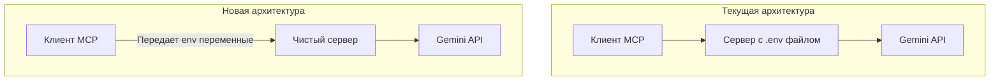
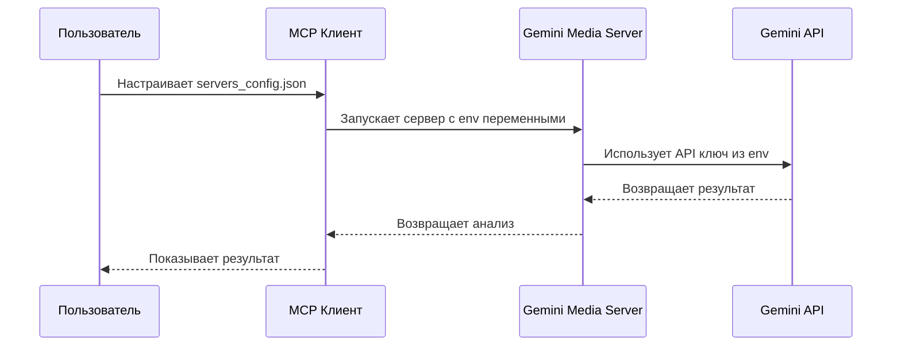
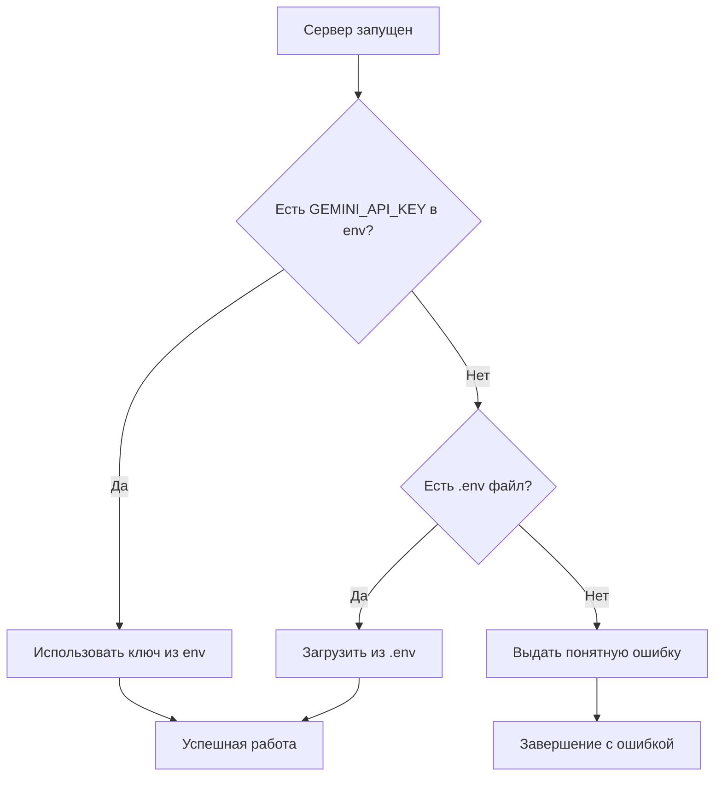

# Как мы работаем с задачами?

В этом документе описывается процесс работы с задачами в нашем проекте, включая формат описания задач, использование диаграмм для визуализации и сбор информации с помощью Context7.

Когда пользователь просит создать задачу, мы следуем определенному формату для обеспечения ясности и эффективности.

Если из контекста истории чата уже известно, что и как надо делать, мы можем сразу приступить к оформлению текста задачи.

В противном случае, мы собираем необходимую информацию с помощью Context7, используя поисковые запросы, такие как `/modelcontextprotocol/python-sdk` и `/googleapis/python-genai`, чтобы найти релевантные данные.

Так же можно использовать поиск через Brave Search или другие доступные инструменты для сбора информации.

В конце, мы оформляем задачу в виде GitHub Issue, добавляя диаграммы для лучшего понимания и визуализации процесса.

И отправляем ее в репозиторий, через инструмент Github для работы с задачами. Возвращаем номер созданной задачи пользователю.

Добавляем комментарии к задаче по мере просьбы пользователя, уточняя детали или предоставляя дополнительную информацию.

Перед публикацией задачи, обязательно показываем пользователю в чате ее целиком, для подтверждения корректности и полноты информации.

После чего, обязательно напоминаем пользователю о том, что неплохо было бы обновить банк памяти.

Пример описания одной из задач которые мы решали:

=========

# Задача #2: Реализация правильной передачи API ключей для локальных MCP серверов

## 📝 Полное описание задачи

### Проблема

Текущая реализация Gemini Media MCP сервера использует `.env` файл для загрузки API ключей, что не соответствует best practices для локальных MCP серверов. Согласно документации MCP Python SDK, локальные серверы должны получать конфигурационные данные (включая API ключи) через переменные окружения, передаваемые клиентом, а не хранить их в `.env` файлах на сервере.

### Цель

Рефакторинг архитектуры передачи API ключей для соответствия стандартам MCP экосистемы. Сделать сервер более портативным, безопасным и удобным для пользователей, убрав зависимость от локальных конфигурационных файлов.

## 📊 Архитектурные изменения

### Диаграмма архитектуры до и после

**Описание:** Диаграмма показывает переход от проблемной архитектуры с `.env` файлом на сервере к правильной архитектуре, где все конфигурационные данные передаются через клиента. В новой архитектуре сервер становится "чистым" и не содержит конфиденциальных данных, что улучшает безопасность и портативность.



### Диаграмма последовательности передачи API ключа

**Описание:** Диаграмма показывает полный процесс передачи API ключа от пользователя до Gemini API. Пользователь настраивает ключ в клиентской конфигурации, которая передается серверу через переменные окружения. Сервер использует этот ключ для аутентификации в Gemini API и возвращает результат анализа обратно пользователю.



### Логическая диаграмма получения API ключа

**Описание:** Диаграмма показывает алгоритм получения API ключа с приоритетом переменных окружения над `.env` файлом. Сервер сначала проверяет наличие ключа в переменных окружения, переданных клиентом. Если ключ не найден, проверяется `.env` файл (только для разработки). Если оба источника пусты, выдается понятное сообщение об ошибке с рекомендациями по решению проблемы.



## 🔍 Исследование и поисковые запросы

### Context7 запросы

- **Запрос 1:** `/modelcontextprotocol/python-sdk`
  - Тема: `configuration environment variables api keys`
  - Токены: 8000
  - Цель: Поиск best practices для локальных MCP серверов

- **Запрос 2:** `/googleapis/python-genai`
  - Тема: `api key authentication configuration`
  - Токены: 5000
  - Цель: Поиск информации по работе с Gemini API

### Результаты исследования

Исследование показало, что MCP Python SDK рекомендует передачу API ключей через клиентскую конфигурацию в `servers_config.json` с использованием блока `env`. Это обеспечивает лучшую безопасность и портативность, так как сервер не содержит конфиденциальных данных и может быть легко распространен.

## 🔧 Конкретная реализация

### Файлы для изменения

| 📁 Файл | 🔧 Статус | 📝 Описание |
|---------|-----------|-------------|
| **config.py** | 🔄 Изменение | Основная логика загрузки API ключей с приоритетом env переменных |
| **server.py** | 🔄 Изменение | Улучшенная обработка ошибок конфигурации |
| **pyproject.toml** | 🔄 Изменение | Добавление CLI зависимостей и скриптов |
| **README.MD** | 🔄 Изменение | Обновление инструкций по установке |
| **docs/** | 🔄 Изменение | Документация по новой архитектуре |
| **scripts/install_server.py** | ➕ Создание | CLI инструменты для установки сервера |
| **config/mcp_config.py** | ➕ Создание | Конфигурация MCP сервера и клиента |

#### config.py

**Описание:** Основной файл конфигурации, который будет переработан для поддержки гибкой загрузки API ключей с приоритетом переменных окружения над `.env` файлом. Добавляется функция `get_api_key()` с понятными сообщениями об ошибках.

```python
# Текущая реализация (проблемная):
import os
from dotenv import load_dotenv

load_dotenv()
GEMINI_API_KEY: str | None = os.getenv("GEMINI_API_KEY")
if not GEMINI_API_KEY:
    raise ValueError("GEMINI_API_KEY not found in environment variables...")

# Новая реализация (рекомендуемая):
def get_api_key() -> str:
    """Получение API ключа с приоритетом переменных окружения"""
    # 1. Переменные окружения от клиента
    api_key = os.getenv("GEMINI_API_KEY")
    if api_key:
        return api_key
    
    # 2. .env файл (только для разработки)
    try:
        from dotenv import load_dotenv
        load_dotenv()
        api_key = os.getenv("GEMINI_API_KEY")
        if api_key:
            return api_key
    except ImportError:
        pass
    
    # 3. Ошибка с понятным сообщением
    raise ValueError(
        "GEMINI_API_KEY not found. "
        "Please set it as environment variable or use MCP client configuration."
    )
```

#### server.py

**Описание:** Основной файл сервера, который будет дополнен улучшенной обработкой ошибок конфигурации. Добавляется проверка доступности API ключа при запуске сервера с понятными сообщениями для пользователя.

```python
# Добавить улучшенную обработку ошибок:
import logging
import sys

logger = logging.getLogger(__name__)

try:
    from config import get_api_key
    GEMINI_API_KEY = get_api_key()
except ValueError as e:
    logger.error(f"Configuration error: {e}")
    # Понятное сообщение для пользователя
    print(f"❌ Configuration error: {e}")
    print("💡 Solution: Set GEMINI_API_KEY environment variable or use MCP client configuration")
    sys.exit(1)
```

#### pyproject.toml

```toml
# Добавить CLI зависимости:
[project.optional-dependencies]
cli = [
    "click>=8.0.0",
    "typer>=0.9.0",
    "mcp[cli]>=1.0.0",
]

[project.scripts]
install-gemini-mcp = "scripts.install_server:main"
```

### Примеры конфигурации для MCP клиентов

#### Claude Desktop (servers_config.json)

```json
{
  "mcpServers": {
    "gemini-media-analyzer": {
      "command": "python",
      "args": ["-m", "server"],
      "env": {
        "GEMINI_API_KEY": "sk-your-actual-key-here"
      }
    }
  }
}
```

#### MCP CLI установка

```bash
# Установка с передачей переменных окружения
uv run mcp install server.py -v GEMINI_API_KEY=your_key_here

# Или загрузка из .env файла (только для разработки)
uv run mcp install server.py -f .env
```

### Примеры кода из документации MCP SDK

#### StdioServerParameters

```python
server_params = StdioServerParameters(
    command="python",
    args=["server.py"],
    env={"GEMINI_API_KEY": os.environ.get("GEMINI_API_KEY", "")},
)
```

#### FastMCP с конфигурацией

```python
from mcp.server.fastmcp import FastMCP

mcp = FastMCP("gemini-media-analyzer")

# Сервер автоматически получает env переменные от клиента
@mcp.tool()
def analyze_image(image_path: str) -> dict:
    """Анализ изображения с использованием API ключа из env"""
    # GEMINI_API_KEY автоматически доступен через config.get_api_key()
    return {"analysis": "результат анализа"}
```

## 🎯 Конкретные классы для обновления

1. **config.py** - класс `ConfigManager` (новый)
2. **utils/gemini_client.py** - класс `GeminiClient` (обновить `__init__`)
3. **scripts/install_server.py** - класс `ServerInstaller` (новый)
4. **config/mcp_config.py** - классы `MCPServerConfig`, `MCPClientConfig` (новые)

## 🚀 TODO лист по задаче

- [ ] Обновить `config.py` для гибкой загрузки API ключей
- [ ] Добавить CLI инструменты для установки сервера с переменными окружения
- [ ] Создать примеры конфигурации для разных MCP клиентов
- [ ] Обновить документацию с инструкциями по установке
- [ ] Протестировать новую архитектуру на разных платформах
- [ ] Обновить банк памяти с информацией о решении

## 📁 Файлы для изменения

- **config.py** - основная логика загрузки API ключей
- **server.py** - возможные улучшения обработки ошибок
- **pyproject.toml** - добавление CLI зависимостей
- **README.MD** - обновление инструкций по установке
- **docs/** - документация по новой архитектуре

## 🎯 Ожидаемые результаты

1. Сервер работает без `.env` файла в продакшене
2. API ключи передаются через клиентскую конфигурацию
3. Улучшена портативность и безопасность сервера
4. Понятные сообщения об ошибках при отсутствии ключа
5. Поддержка разных сценариев использования (разработка/продакшен)
