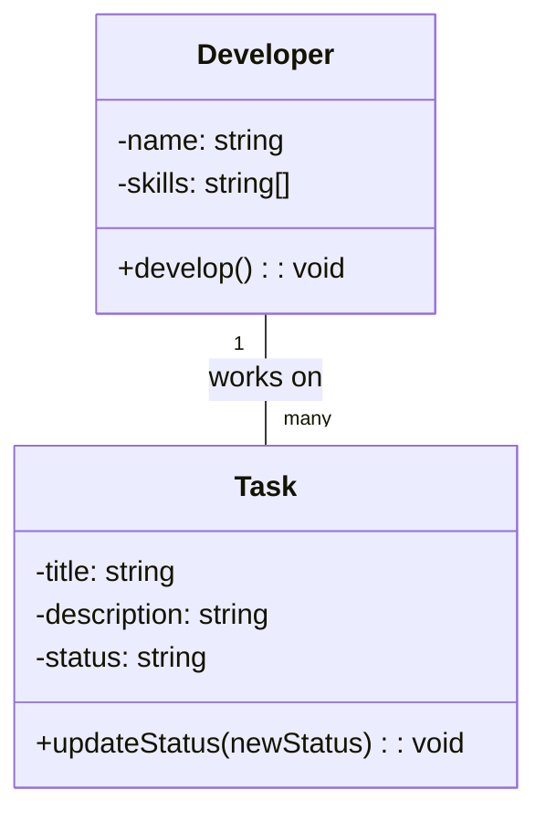
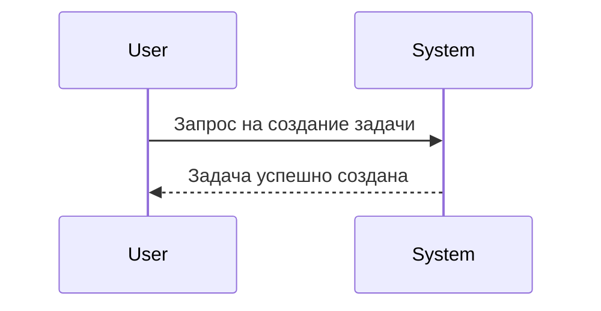
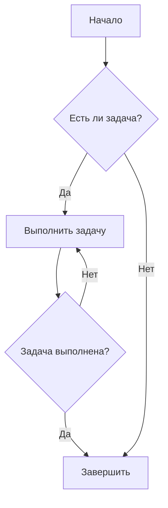

# Как мы работаем с задачами?

В этом документе описывается процесс работы с задачами в нашем проекте, включая формат описания задач, использование диаграмм для визуализации и сбор информации с помощью Context7.

Когда пользователь просит создать задачу, мы следуем определенному формату для обеспечения ясности и эффективности.

Если из контекста истории чата уже известно, что и как надо делать, мы можем сразу приступить к оформлению текста задачи.

В противном случае, мы собираем необходимую информацию с помощью Context7, используя поисковые запросы, такие как `/modelcontextprotocol/python-sdk` и `/googleapis/python-genai`, чтобы найти релевантные данные.

Так же можно использовать поиск через Brave Search или другие доступные инструменты для сбора информации.

В конце, мы оформляем задачу в виде GitHub Issue, добавляя диаграммы для лучшего понимания и визуализации процесса.

И отправляем ее в репозиторий, через инструмент Github для работы с задачами. Возвращаем номер созданной задачи пользователю.

Добавляем комментарии к задаче по мере просьбы пользователя, уточняя детали или предоставляя дополнительную информацию.

Перед публикацией задачи, обязательно показываем пользователю в чате ее целиком, для подтверждения корректности и полноты информации.

После чего, обязательно напоминаем пользователю о том, что неплохо было бы обновить банк памяти.

Пример описания задачи:

=========

## 📝 Формат описания задачи

Текст описывающий задачу. 2-3 параграфа, объясняющих суть задачи и её важность.
Указание файлов и классов которые будут изменены, добавлены или удалены.

После текста, можно добавить диаграммы для лучшего понимания.

### 📊 Диаграмма классов

Описание диагрммы.

### 📈 Диаграмма последовательности

Описание диагрммы.

### 🗺️ Логическая диаграмма (Flowchart)

Описание диагрммы.

### 📚 Сбор информации с помощью Context7

При использовании Context7 для сбора информации, необходимо документировать следующие моменты:

#### 🔍 Поисковые запросы

Указываем какие инструменты и запросы были выполнены

* `/modelcontextprotocol/python-sdk`: Поиск информации по Python SDK для MCP.
* `/googleapis/python-genai`: Поиск информации по Gemini API.

#### 📄 Описание

Здесь будет подробное описание того, какая информация была найдена и как она будет использоваться в задаче.

## 🚀 Предварительный TODO лист по задаче

* [ ] Пункт 1
* [ ] Пункт 2
